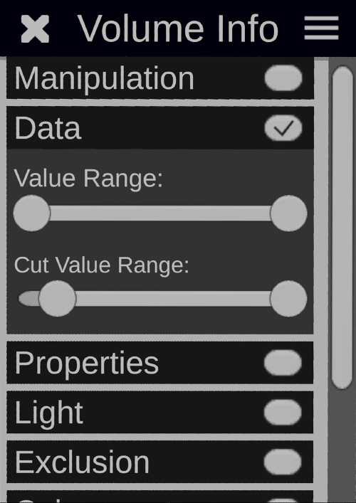
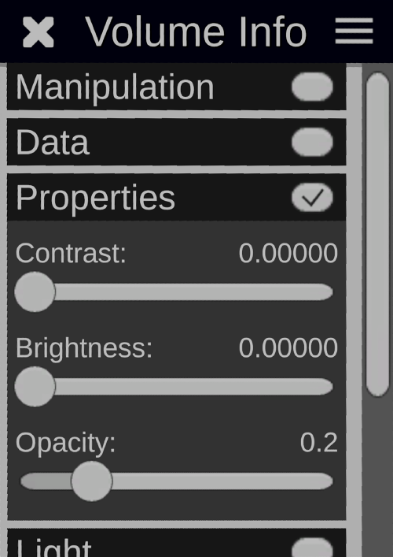
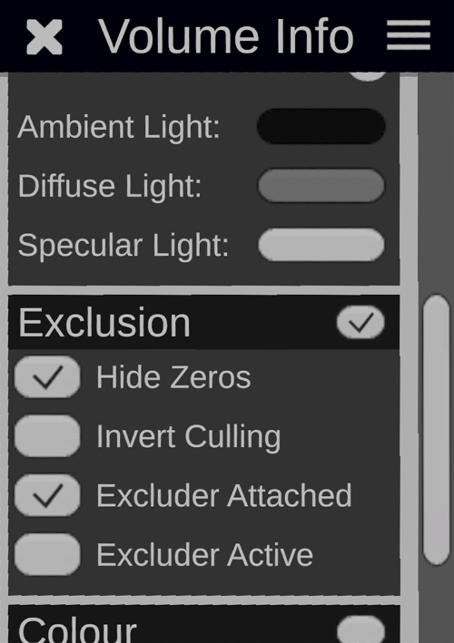
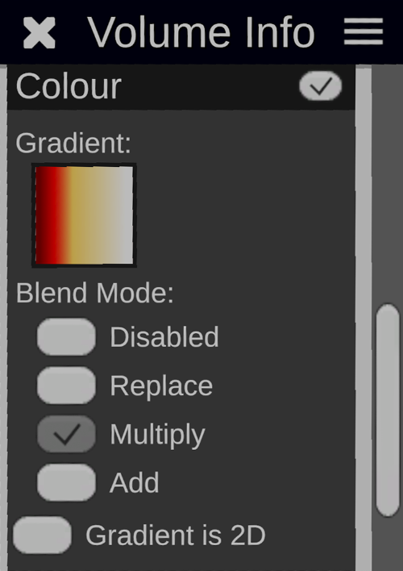
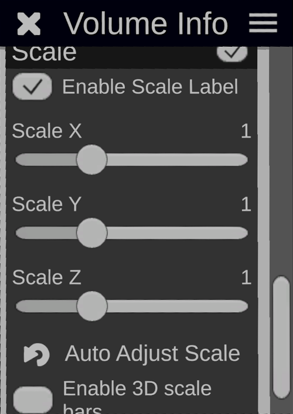
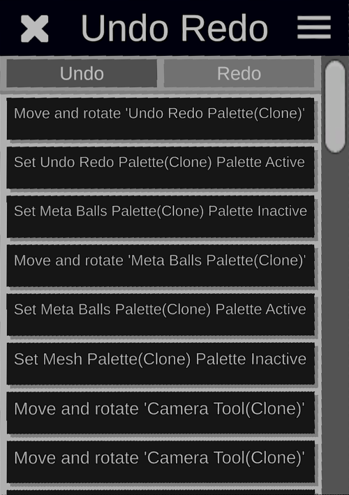

# BabelVR-Releases
This is a repository for releases of BabelVR executables.

# Abstract

Biological objects both at the macro and micro level often have complex 3D architectures that can be difficult to interpret, measure and manipulate using traditional 2D software. In geometric morphometric analysis, understanding shape variation in 3D images generated from different anatomical structures requires time-consuming landmarking procedures before such analyses can be undertaken.  We present BabelVR as a novel application allowing interaction with 3D images, which has specific enhancements to aid measurement and landmarking of biological object(s) using Virtual Reality.

# Overview
BabelVR is a general purpose method for visualising 3D volumetric data using either HTC Vive or Meta Rift / Quest. 
More recently we have been focusing on use cases for the process of landmarking complex 3D images. Using Virtual Reality allows you to place these pointers very accurately on the surface or even inside the object you are working with, which can be more difficult using traditional 2D workflows. You can then export these landmarks to packages such as [MorphoJ](https://morphometrics.uk/MorphoJ_page.html)

<iframe width="560" height="315" src="https://www.youtube.com/embed/XzY7f1UY25o" title="YouTube video player" frameborder="0" allow="accelerometer; autoplay; clipboard-write; encrypted-media; gyroscope; picture-in-picture" allowfullscreen></iframe>
*Figure 1: Introductory video showing landmarking using BabelVR.*

# Getting started
When you first run BabelVR, a folder is created in your user Documents `"%UserProfile%\Documents\Babel"`.

This contains various subfolders with data to be loaded into the program (`Nii` format volumetric data, `Obj` meshes...), configuration files (which in most cases you are unlikely to need to be aware of), and any saved or exported data (such as landmark data created from within the app).

## Image files

In order to bring new data into the program, you copy files into the `Nii` or `Objects` folders, which will be scanned when the program starts and used to populate the "Volumes" GUI. The Nii files can be generated from DICOM or any 3D stack images (including colour) using software such as [Fiji](https://imagej.net/software/fiji/) via "Save as" using the [Nii plugin](https://imagej.nih.gov/ij/plugins/nifti.html)

## Interacting in VR

There are two controllers with the Vive or Oculus headset. 
VR is a relatively new way of interacting with 3D objects. Instead of mouse you use controllers. We will refer to controller 1 and 2. Both controllers allow activation of a laser pointer to point and select menu items using the trigger. You can close down menus by clicking on the X in the top left corner of the panel. 

Each controller has a "grab zone" which when you move over the object and then press the grab buttons(s) it allows you to grab the object (the outline of the selected object will highlight). This means to you can then manipulate it in the 3D space as long as you hold on to it. This applies to most elements that you encounter in the application: GUI panels, landmarks, volumes etc.

Controller 1 is used to activate the function via the circular menu and the Menu bar is used to access settings for each button and 
other settings and functions.

# Controllers HTC Vive

Is in the dominant hand (left or right). Image shows a Vive controller.

The circular menu (accessed via track pad on Vive and thumbstick on Quest) activates the function. See the Quest diagram below that shows the icons on the controllers. 

# Controllers Meta Quest 2
Here is a schematic of the Meta Quest controllers

***

***
In the software they look like this. Access the different functions by moving the thumbsticks on the controller and clicking on the top of the thumbstick.

# More On Folders
As discussed a `BabelVR` folder in `My Documents` will be created. In this folder are various subfolders. The following folders are relevant to end-users:
## Nii
Place all your Niftii (Nii) images here and they will be accessible from the Volumes menu.
## Objects
Place any Mesh (OBJ format) objects in this folder and they will be accessible from the Volumes menu.
## Exports
Any data that is saved via the Export function is put here. For example, morphoJ files. 
## Screenshots
The snapshot tool creates timestamped PNG images when activated and these are stored in here.

It is advised *NOT* to tamper with the other folders in the `BabelVR` directory as they are used internally by the software. 

# Menus
These icons are ways of getting access to properties of the different functions of BabelVR. The functions are mostly accessed from the right controller by the trackpad (HTC Vive) or thumbstick (Meta Quest).

## Volumes 
Nii files can be accessed here.

There are various settings that you can apply to the loaded volume which can be accessed buy the COG icon on the menu bar.

## Settings
This menu contains settings that apply to the currently open and 'active' volume. Mostly, these settings are to do with parameters used for rendering (note that many of these will have no effect if the object is an `obj` mesh).

Figure 2: Video showing an overview of settings / volume info menu functionality

### Manipulation

This determines how the object will behave in relation to it's landmarks when it is grabbed or manipulated.

**Manipulate volume**: if this is disabled, it prevents the object itself from being moved. This can be useful when moving landmarks to avoid accidentally moving the entire model.

**Seperate children**: When enabled, this allows the object to be moved without corresponding landmarks moving with it. It can be useful when attempting to re-allign a model to a set of existing landmarks from a different model.

### Data
This is very useful for rescaling the values of the voxels of the volume used in rendering.

Voxel intensity will be normalised to the range determined by the lower and upper "Value Range" slider positions.

Values outside of the range set by the "Cut Value Range" slider will be discarded.

### Properties
Allows the adjustment of contrast, brightness and opacity of the volume.

### Light
when Enabled activates light simulation / ray tracing. You will see a torch that can be picked up and positioned anywhere in the scene to adjust the light flow. This is useful to create a more realistic appearance or to resolve certain features. Surface threshold (opacity), alpha, shininess and colouring of the light (ambient / diffuse / specular) can be adjusted. 

### Exclusion
This is used to be able to slice or exclude part of object. For example you want to partially exclude a skull so you can look inside. If you check the _Excluder_ _Active_ box (by default) a grey cube will appear that can be picked up and positioned to exclude regions of the volume.
Checking _Invert_ _Culling_ only shows the volume when it is contained inside the cube, so the visible surface is the side of a cube.

### Colour
Transfer gradient images consisting of 256 x 256 pixel PNGs placed in the Babel > Transfers directory can be applied here. This allows colouring of certain densities with colour which can be useful for highlighting features. We may in future provide interfaces for determining gradient transfer curves within the application.

### Label
Turns a file-name label for the volume on / off and also can vary it's size.

## Scale 
Resize the voxels of the image on the x, y, or z axis. Useful if the image has been imported with incorrect relative dimensions - although it should be noted that there is also a feature for [overriding scale metadata](overrides.csv) from outside of the application.

## Rendering
Increase the number of samples on the ray cast which can improve the volume rendering quality and avoid colour fringing, at the cost of performance.

# Reference Annotations
You can upload landmark reference annotations as a csv file defining the name, colour and description of each landmark in Babel > Groups directory.
Colour is helpful as aide for left / right positioning. In this case we have used red for right, green for left based markers and white for everything else.

# Save
Provides various options for saving and exporting data.

# Landmarks
* Ray Based draw - the landmark will be constrained to move across the surface of the object. This experimental feature in theory makes it easier to position a landmark on the surface.
* Add Labels - Shows the label based on the reference file
* Continuous Draw - Draws points continuously when the trigger is held down
* Snap to excluder - Landmarks will follow excluders contours where available ===did I get rid of this?===

# Delete

# Tape measure
Properties of the measuring tool. 
* Single Handed - uses one controller, clicking and dragging to measure the distance dragged.
* Double Handed - uses both controllers to measure the distance from one to the other.
* Stay after release - means just that, otherwise it disappears quickly.

# Snapshot
This allows you to take pictures within BabelVR of your volume from different angles. 

* Enabled - start the Snapshot function
* Attached to active volume - the Camera will move when you move the volume
* Attach light to camera - attach the torch to the camera 

# Eraser
Erase allows removal of parts of the volume (voxels). It works in the same way as the "Excluder" function but draws continuous metaballs to exclude parts of the volume.
* Size - size of the metaball
* Show Outline - shows a yellow outline around the excluded area

# Undo
Shows a history of all the operations that can be undone / redone.

# Reference images
if PNGs or JPGs are place in the folder Babel > References these will be seen as a list in this panel. Activating the check boxes will show the reference image in the virtual world.

They can be moved to their default position adjacent to the panel by pressing the 'reset' arrow button.

The contents of this folder is polled, so it is possible to add new images during a session by using standard file-system operations on the desktop.

The large "enabled" toggle at the top of the list can be used to temporarily hide all images.

# Debug console
This allows you to view application logs at runtime. If you experience errors or unexpected behaviour, this can be used to create a draft email which may help us to diagnose the issue.

